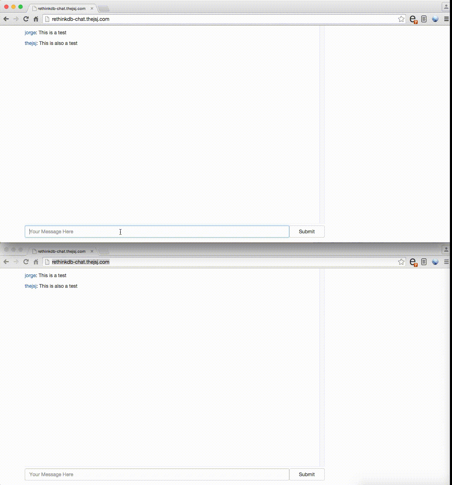

# RethinkDB Chat



Dead simple, realtime chat app built with RethinkDB and React.js.

## Setup

Install RethinkDB

```
brew install rethinkdb
```

Install gulp

```
npm install -g gulp
```

Install node dependencies
```
npm install
```

## Running

Run node server

```
npm run dev
```

Compile client side assets

```
gulp
```
